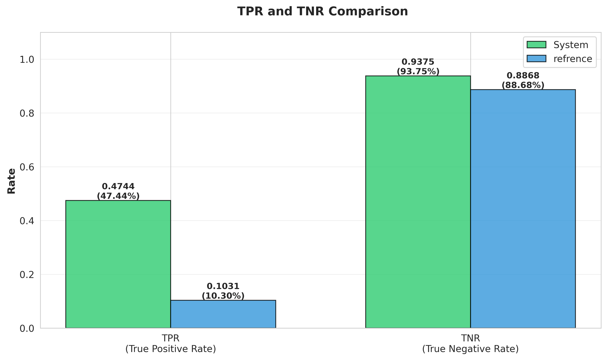

# RGB-D Robotic Grasp Detection: Mask R-CNN + GG-CNN

A two-stage robotic vision pipeline that determines a grasp pose for
objects of interest in cluttered tabletop scenes using RGB-D input.

> ENN583 Advanced Neural Networks · Queensland University of Technology  
> Author: Omar Mohamed

---

## 📽️ Demo



---

## 🧩 Problem & approach

Detecting reliable grasps in cluttered scenes requires understanding both
object identity and depth geometry. A single-stage approach struggles to
separate which object to grasp from how to grasp it. This pipeline decouples
the two problems into sequential stages:

**Stage 1 — Object detection (Mask R-CNN)**
- Input: RGB-D image
- Output: segmentation mask + bounding box per object of interest
- Chosen over Fast R-CNN (no instance masks) and rule-based methods
  (no generalisation to novel objects)

**Stage 2 — Grasp prediction (GG-CNN)**
- Input: masked depth crop (300×300), preprocessed as:
  - Crop to bounding box
  - Resize to 300×300
  - Inpaint NaN values
  - Min-max normalise to [−1, 1]
- Output: grasp parameters (u, v, width, angle)

If no object is detected in Stage 1, the pipeline outputs: *object not present*.

---

## 📊 Results

Evaluated on a held-out test set (604 total samples: 508 object-present,
96 object-not-present).

| Metric                        | System  | Reference |
|-------------------------------|---------|-----------|
| True Positive Rate (TPR)      | 47.44%  | 10.30%    |
| True Negative Rate (TNR)      | 93.75%  | 88.68%    |

### Detection breakdown

| Case                  | Count |
|-----------------------|-------|
| True Positives (TP)   | 241   |
| False Negatives (FN)  | 267   |
| True Negatives (TN)   | 90    |
| False Positives (FP)  | 6     |

**Key observations:**
- TPR of 47.44% significantly outperforms the reference baseline (10.30%),
  demonstrating strong improvement in detecting valid grasps
- TNR of 93.75% shows reliable rejection of absent objects (only 6 false alarms
  out of 96 negative cases)
- Main failure mode: false negatives (267 missed grasps), often caused by
  suboptimal predicted grasp angle on cluttered or occluded objects

---


```


---

## 🙏 References & acknowledgements

- GG-CNN: Morrison et al., RSS 2018 — [github.com/dougsm/ggcnn](https://github.com/dougsm/ggcnn)
- Mask R-CNN: He et al., ICCV 2017 — [doi:10.1109/ICCV.2017.322](https://doi.org/10.1109/ICCV.2017.322)
- Detectron2: [github.com/facebookresearch/detectron2](https://github.com/facebookresearch/detectron2)
